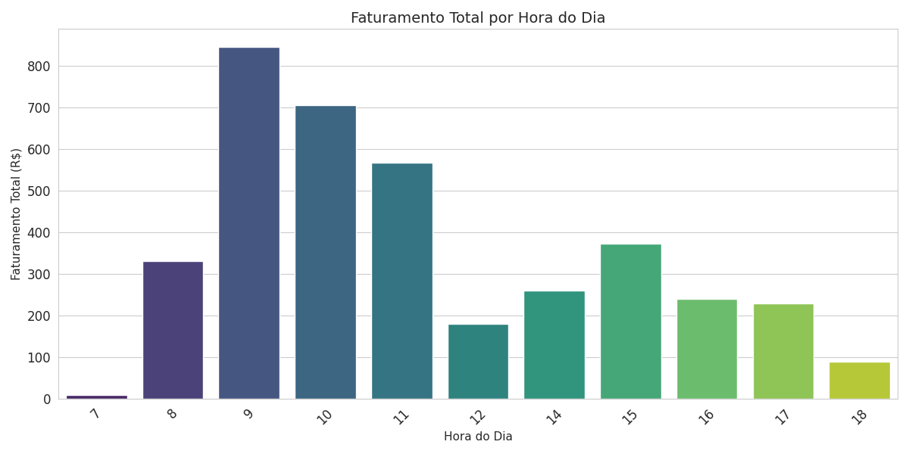
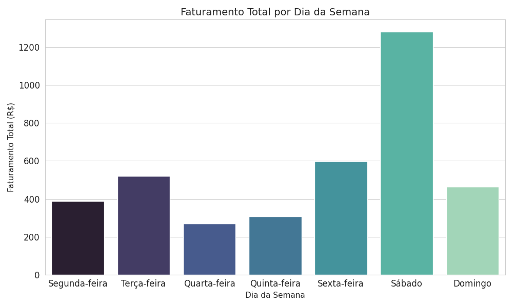
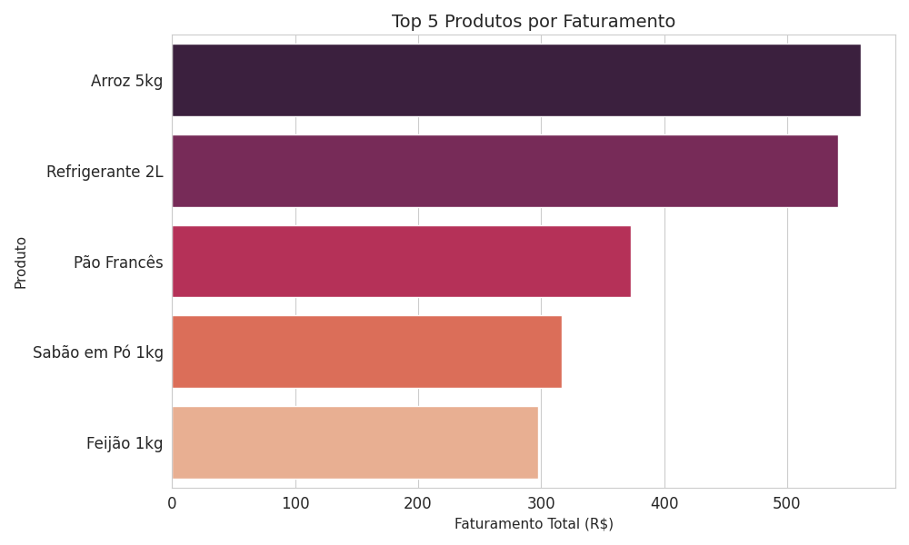
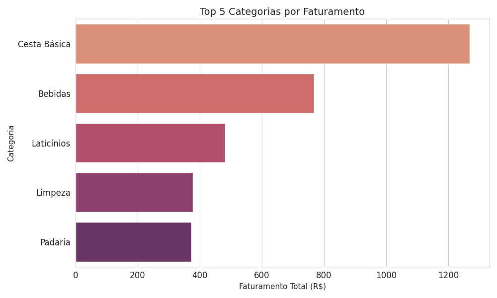
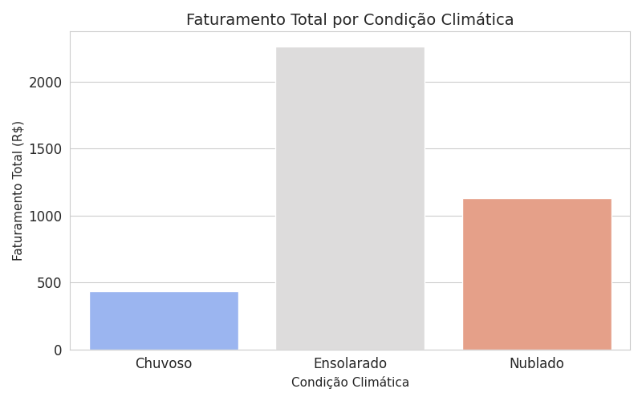
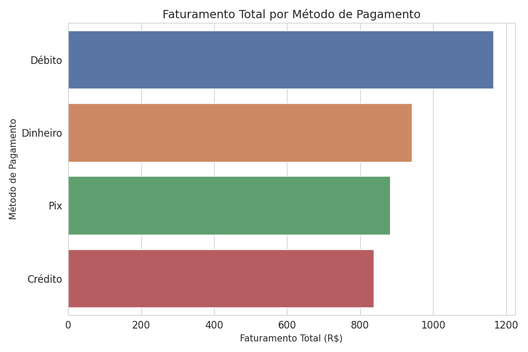

# Análise de Dados da Mercearia

Este repositório contém uma análise de dados transacionais de uma mercearia, com o objetivo de identificar padrões de vendas, horários de pico, produtos mais vendidos, influência climática e preferências de pagamento.

## Estrutura dos Dados

Os dados foram fornecidos com as seguintes colunas:

- `ID_Transacao`: Identificador único da transação.
- `Data`: Data da transação (AAAA-MM-DD).
- `Hora`: Hora da transação (HH:MM:SS).
- `ID_Produto`: Identificador único do produto.
- `Nome_Produto`: Nome do produto.
- `Categoria_Produto`: Categoria à qual o produto pertence.
- `Quantidade`: Quantidade do produto vendida na transação (pode ser em unidades ou kg).
- `Preco_Unitario`: Preço unitário do produto.
- `Valor_Total_Item`: Valor total do item na transação (`Quantidade` * `Preco_Unitario`).
- `Metodo_Pagamento`: Método de pagamento utilizado (Dinheiro, Pix, Débito, Crédito).
- `Clima`: Condição climática no momento da transação (Nublado, Ensolarado, Chuvoso).
- `Promocao_Ativa`: Indica se havia promoção ativa para o item na transação (Sim/Nao).

## Análises e Resultados

### 1. Faturamento Total por Hora do Dia

Esta análise revela os períodos de maior volume de receita ao longo do dia, sendo fundamental para a otimização de operações, como alocação de pessoal e gestão de estoque.

**Principais Observações:**
* **Picos Matutinos:** Os horários das **09h, 10h e 11h** demonstram o maior faturamento, indicando que o período da manhã concentra a maior parte da atividade comercial.
* **Pico Vespertino:** Um segundo pico de faturamento é observado às **15h**, sugerindo um aumento da demanda no meio da tarde.

### 2. Faturamento Total por Dia da Semana

Este gráfico ilustra a distribuição do faturamento total ao longo dos dias da semana, permitindo identificar os dias de maior e menor movimento.

**Principais Observações:**
* **Sábado Dominante:** O **sábado** se destaca como o dia de maior faturamento, reforçando sua importância estratégica.
* **Fim de Semana Forte:** A **sexta-feira** também apresenta um volume significativo de vendas, complementando o movimento do final de semana.
* **Destaque da Terça-feira:** A **terça-feira** surge como um dia de faturamento notável para um dia útil, o que pode indicar oportunidades específicas ou hábitos de consumo a serem investigados.

### 3. Top 5 Produtos por Faturamento

Este gráfico identifica os produtos que mais contribuem financeiramente para a mercearia, sendo cruciais para a gestão de compras e precificação.

**Principais Observações:**
* Produtos como **Arroz 5kg**, **Refrigerante 2L**, **Pão Francês**, **Sabão em Pó 1kg** e **Feijão 1kg** são os maiores geradores de receita, destacando-se como itens essenciais e de alto valor agregado no volume total de vendas.

### 4. Top 5 Categorias por Faturamento

A análise por categoria de produtos oferece uma visão estratégica sobre quais segmentos de mercado são mais lucrativos e impulsionam o desempenho geral da mercearia.

**Principais Observações:**
* As categorias de **Cesta Básica**, **Bebidas**, **Laticínios**, **Limpeza** e **Padaria** são as que mais contribuem para o faturamento. A `Cesta Básica` é a principal categoria em termos de receita gerada.

### 5. Faturamento Total por Condição Climática

Este gráfico explora a possível influência das condições climáticas no faturamento da mercearia, identificando como diferentes climas podem afetar o comportamento de compra dos clientes.

**Principais Observações:**
* **Clima Ensolarado:** Os dias **ensolarados** correlacionam-se com o maior faturamento, indicando que o tempo bom favorece as compras na loja física.
* **Impacto da Chuva:** Em contraste, os dias **chuvosos** apresentam o menor volume de vendas, sugerindo a necessidade de estratégias para mitigar essa queda (ex: serviços de entrega, promoções direcionadas).

### 6. Faturamento Total por Método de Pagamento

Compreender a preferência dos clientes em relação aos métodos de pagamento é essencial para a gestão financeira, otimização de caixas e negociação de taxas.

**Principais Observações:**
* O **Débito** é o método de pagamento predominante em termos de faturamento total, seguido de perto por **Dinheiro** e **Pix**. O **Crédito** também possui uma participação relevante nas transações financeiras.

### 7. Padrão de Vendas Cruzadas (Produtos Mais Comprados Juntos)

Esta análise identifica os produtos que são frequentemente comprados na mesma transação. Compreender essas associações pode auxiliar no planejamento de promoções conjuntas, otimização do layout da loja e estratégias de recomendação de produtos.

| Par de Produtos | Frequência de Co-ocorrência |
|---|---|
| Leite Integral 1L e Pão Francês | 6 |
| Arroz 5kg e Feijão 1kg | 6 |
| Presunto 100g e Queijo Mussarela 100g | 5 |
| Manteiga 200g e Pão Francês | 4 |
| Presunto 100g e Pão Francês | 4 |
| Pão Francês e Queijo Mussarela 100g | 4 |
| Banana Prata kg e Maçã Gala kg | 2 |
| Arroz 5kg e Óleo de Soja 900ml | 2 |
| Feijão 1kg e Óleo de Soja 900ml | 2 |
| Queijo Mussarela 100g e Refrigerante 2L | 2 |

**Principais Observações:**
* Os pares mais frequentes são **Leite Integral 1L** com **Pão Francês**, e **Arroz 5kg** com **Feijão 1kg**, indicando uma forte correlação de compra entre esses itens básicos de café da manhã e cesta de alimentos.
* Outras associações notáveis incluem produtos da categoria de frios (**Presunto 100g** e **Queijo Mussarela 100g**) e hortifruti (**Banana Prata kg** e **Maçã Gala kg**).
